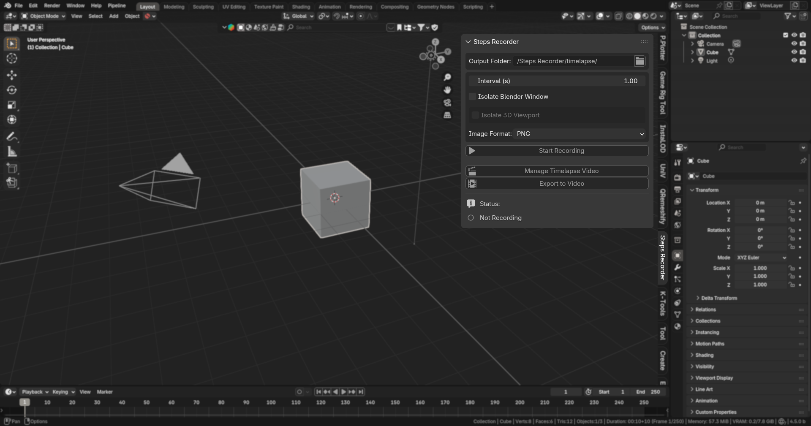
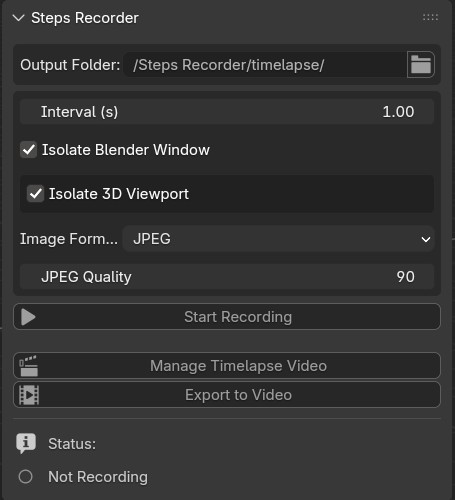
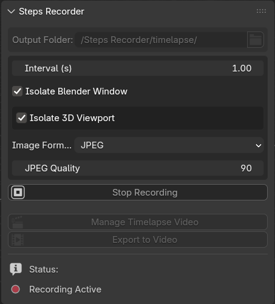
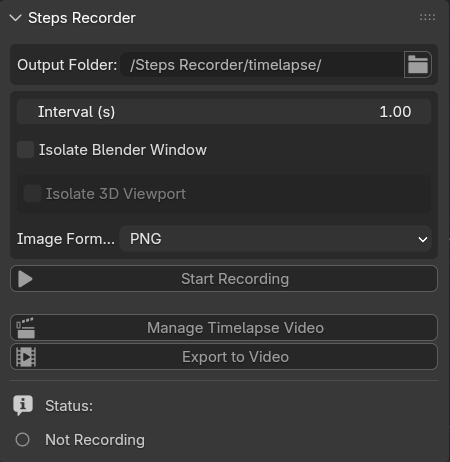

# Steps-Recorder

 [![discord badge]][discord link]

[![latest release badge]][latest release link] [![github open issues badge]][github open issues link]

[discord badge]: https://img.shields.io/discord/682183255734354002?label=Discord&style=for-the-badge
[discord link]: https://discord.gg/cXxv2KtP
[github open issues badge]: https://img.shields.io/bitbucket/issues/roosaramendis/Steps-Recorder?style=for-the-badge
[github open issues link]: https://github.com/roosaramendis/Steps-Recorder/issues
[latest release badge]: https://img.shields.io/github/v/tag/roosaramendis/Steps-Recorder?style=for-the-badge
[latest release link]: https://github.com/roosaramendis/Steps-Recorder/releases

# Why you need dis?

- Show off your progress!

# Addon UI

    
    

    
    
    

# How to use

1. Set Output Folder 
Choose where you want to save your screenshots by clicking the folder icon next to Output Folder.

2. Adjust Capture Interval 
Set how often screenshots should be taken in seconds under Interval (s) less means smooth video, you can drop it until 0.20(personly i use between 0.3 - 1 sec).

3. Set Isolation Options (optional)

    - Enable Isolate Blender Window to only capture Blender.

    - Enable Isolate 3D Viewport to capture only the separated Blender wiondw.

4. Choose Image Format 
Select either JPEG (you can reduced the file size by adjusting quality of image) or PNG for your screenshot format.

5. Start Recording 
Click Start Recording to begin capturing.

6. Stop Recording 
Click Stop Recording to end the capture session(If you start recording again, it will continue from where you left off. even if you close the blender and opend again).

7. Manage Timelapse 
After recording, you can edit or preview your timelapse video using blender video editor by clicking Manage Timelapse Video(recomended), or you can just export them as a video with Export to Video(not recomended, its slow and have less control).

8. Status Indicator 
At the bottom, check the Status to know if recording is active or not.

# TO-DO

- Add option to start recording automatically when you open the blender file
