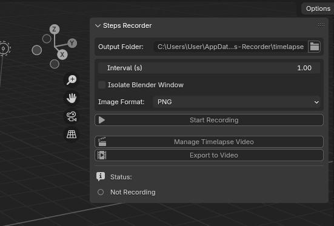
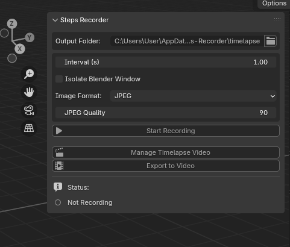
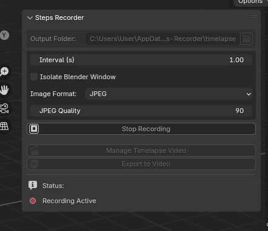

# Steps-Recorder

 [![discord badge]][discord link]

[![latest release badge]][latest release link] [![github open issues badge]][github open issues link]

[discord badge]: https://img.shields.io/discord/682183255734354002?label=Discord&style=for-the-badge
[discord link]: https://discord.gg/cXxv2KtP
[github open issues badge]: https://img.shields.io/bitbucket/issues/roosaramendis/Steps-Recorder?style=for-the-badge
[github open issues link]: https://github.com/roosaramendis/Steps-Recorder/issues
[latest release badge]: https://img.shields.io/github/v/tag/roosaramendis/Steps-Recorder?style=for-the-badge
[latest release link]: https://github.com/roosaramendis/Steps-Recorder/releases

Timelapse recorder for Blender. This addon helps you capture every step of your work to create awesome timelapse videos. Basically, it takes a screenshot every time you do something in Blender, with a time interval you set. After that, you can load those screenshots into the video sequencer, edit however you want, and export. Or, if you’re feeling lazy, just export straight to MP4.

# Why you need dis?

- Show off your progress! It’s perfect for making proof-of-work vids, create timelapse for tiktok or anyother platform its super useful n if you want to flex your skills or avoid getting accused of using AI. Fr, with all these AI bulls###s, this is here you save you.

- Low resource usage. unlike OBS or other screen recorders that eat up your RAM and slow down Blender (specially if you do some havy stufs), Steps Recorder will helps to keep things smooth. i made this cuz i got tired of my potato pc start lagging or ending up geting memory full every time i tried to record my progress.

- Less post-processing. It only records when you’re actually doing stuff in Blender, so you don’t get a bunch of boring ahh AKF footage, we all know that u spend 80% of time to just to stare at the beautiful b⭕️⭕️ty that u sculpted😂🫠, you're complete safe from that in here😁. Plus, you can lock it to just the Blender window—no random any other desktop windows or notifications and ofcuz you want record your ph window accidently in your timelapse. So no need to spend hours on cutting out bullsh##ts.

Level up your workflow, share your process, and happy Blending!

# Addon UI

    
    
    

# How to use

